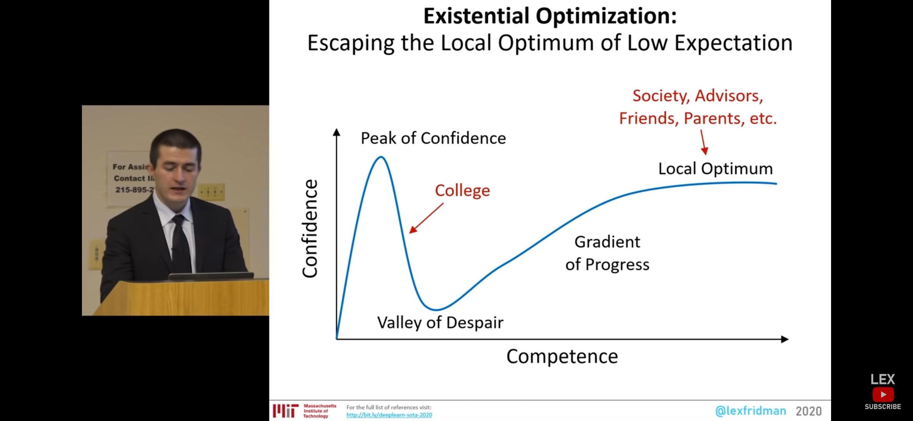
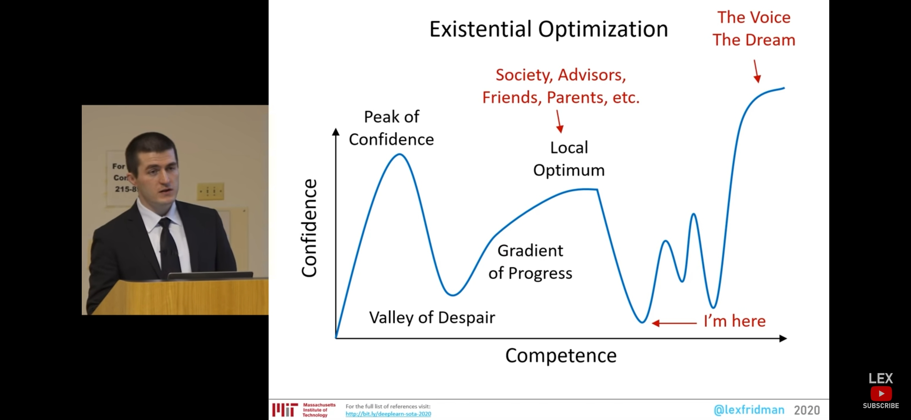
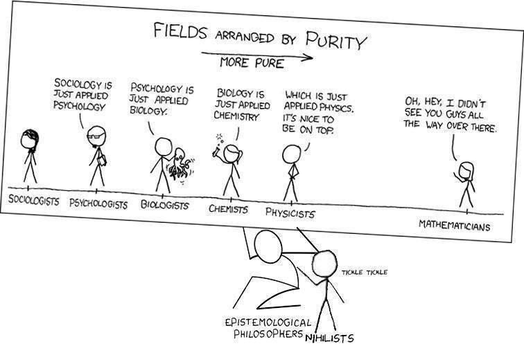
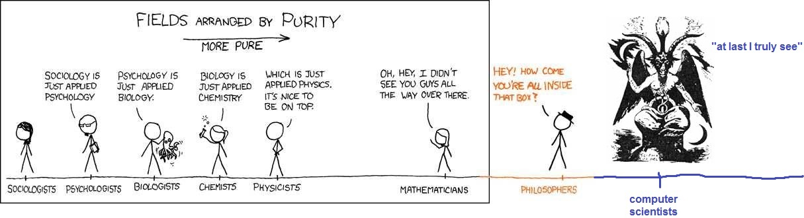

# Answers : Design, Technology and Everything in Between.

**Note: This repository has been used by researchers from "ETH-Zurich" for their research on "open-source software."**

**"If something is important enough, you do it even if the odds are not in your favor" -- Elon Musk.**

This readme will have links to my Quora Answers, Medium, CareerHigh articles. Also has my coding profile and behance design portfolio (basically everything that I have done till date).

### [**medium.com**](https://medium.com/@sethupathibalakrishnan) articles
1. [**My Experiences on Anything and Everything in Life.**](https://medium.com/@sethupathibalakrishnan/my-experiences-on-anything-and-everything-in-life-231eb4699609)
2. [**Custom Macro Placement.**](https://medium.com/@sethupathibalakrishnan/custom-macro-placement-cd63043103b9)
3. [**Tamil Nadu : Some positive aspects.**](https://medium.com/@sethupathibalakrishnan/tamil-nadu-some-positive-aspects-8a46a7565122)
4. [**Experiences with lows in life.**](https://medium.com/@sethupathibalakrishnan/experiences-with-lows-in-life-83164a35a617)
4. [**“Rodha” — A review.**](https://medium.com/@sethupathibalakrishnan/random-7b0298691a0c)
4. [**Observations from my favourite TV Show “SUITS.”**](https://medium.com/@sethupathibalakrishnan/learnings-from-my-favourite-tv-show-suits-e19333f25628)
4. [**Clock Tree Synthesis.**](https://medium.com/@sethupathibalakrishnan/clock-tree-synthesis-c108f9ea0760)
4. [**Algorithmic Problems & their applications in S/W development.**](https://medium.com/@sethupathibalakrishnan/algorithmic-problems-their-applications-in-s-w-development-afeef6206609)
5. [**VLSI-CAD Research Competitions.**](https://medium.com/@sethupathibalakrishnan/vlsi-cad-research-competitions-6a318a1d3ef3)
6. [**Imposter Syndrome.**](https://medium.com/@sethupathibalakrishnan/imposter-syndrome-245d5496e15a)
6. [**Taiwanese Research : My Thoughts.**](https://sethupathibalakrishnan.medium.com/taiwanese-research-my-thoughts-2ed235163a7b)
6. [**Prof. AB Kahng.**](https://github.com/sethupathib/Answers/blob/master/ABK.jpg)

### [**CareerHigh**](https://careerhigh.in) articles
1. [**Static Timing Analysis Roadmap.**](https://careerhigh.in/post/Static-Timing-Analysis-Roadmap)
2. [**CAD Tools Development for VLSI Roadmap.**](https://careerhigh.in/post/CAD-Tools-Development-for-VLSI-Roadmap)

### **Problem Solving**
1. [**Data Structures & Algorithms.**](https://github.com/sethupathib/data_structures)
2. [**CP Practice.**](https://github.com/sethupathib/cp-practice)

### [**CodeForces**](https://codeforces.com) account
[**Sethupathi on CodeForces**](https://codeforces.com/profile/b.sethupathi) -- Still a noob at this :P.

### [**Binary Search**](https://binarysearch.com) account
[**Sethupathi on Binary Search**](https://binarysearch.com/@/sethupathi?tab=progress).
This is an excellent platform that is similar to LeetCode. I have learnt immensely from this.

### [**Leet Code**](https://leetcode.com) account
[**Sethupathi on LeetCode**](https://leetcode.com/submissions/#/1)

### [**Quora**](https://www.quora.com/profile/Sethupathi-Balakrishnan-सेतुपति-बालकृष्णन) answers
1. [**On MOOC's.**](https://www.quora.com/How-effective-are-Moocs-for-learning-programming-languages/answer/Sethupathi-Balakrishnan-%E0%A4%B8%E0%A5%87%E0%A4%A4%E0%A5%81%E0%A4%AA%E0%A4%A4%E0%A4%BF-%E0%A4%AC%E0%A4%BE%E0%A4%B2%E0%A4%95%E0%A5%83%E0%A4%B7%E0%A5%8D%E0%A4%A3%E0%A4%A8?ch=2&srid=O1GE) 
2. [**Surely You're Joking Mr.Feynman.**](https://www.quora.com/Is-Surely-Youre-Joking-Mr-Feynman-Adventures-of-a-Curious-Character-by-Richard-P-Feynman-worth-the-read/answer/Sethupathi-Balakrishnan-%E0%A4%B8%E0%A5%87%E0%A4%A4%E0%A5%81%E0%A4%AA%E0%A4%A4%E0%A4%BF-%E0%A4%AC%E0%A4%BE%E0%A4%B2%E0%A4%95%E0%A5%83%E0%A4%B7%E0%A5%8D%E0%A4%A3%E0%A4%A8?ch=2&srid=O1GE) 
3. [**Static Timing Analysis.**](https://www.quora.com/What-are-some-of-the-best-resources-to-learn-Static-Timing-Analysis-STA-of-Digital-VLSI-Designs/answer/Sethupathi-Balakrishnan-%E0%A4%B8%E0%A5%87%E0%A4%A4%E0%A5%81%E0%A4%AA%E0%A4%A4%E0%A4%BF-%E0%A4%AC%E0%A4%BE%E0%A4%B2%E0%A4%95%E0%A5%83%E0%A4%B7%E0%A5%8D%E0%A4%A3%E0%A4%A8?ch=2&srid=O1GE )
4. [**Investment Banking.**](https://www.quora.com/I-am-an-undergrad-at-BITS-Pilani-interested-in-investment-banking-What-are-some-of-the-courses-or-reading-material-I-could-go-through/answer/Sethupathi-Balakrishnan-%E0%A4%B8%E0%A5%87%E0%A4%A4%E0%A5%81%E0%A4%AA%E0%A4%A4%E0%A4%BF-%E0%A4%AC%E0%A4%BE%E0%A4%B2%E0%A4%95%E0%A5%83%E0%A4%B7%E0%A5%8D%E0%A4%A3%E0%A4%A8?ch=2&srid=O1GE )
5. [**STL.**](https://www.quora.com/What-are-the-best-video-lecturers-to-learn-STL-algorithms-in-C/answer/Sethupathi-Balakrishnan-%E0%A4%B8%E0%A5%87%E0%A4%A4%E0%A5%81%E0%A4%AA%E0%A4%A4%E0%A4%BF-%E0%A4%AC%E0%A4%BE%E0%A4%B2%E0%A4%95%E0%A5%83%E0%A4%B7%E0%A5%8D%E0%A4%A3%E0%A4%A8?ch=2&srid=O1GE )
### [**Linkedin**](https://www.linkedin.com) Profile
[**Sethupathi Balakrishnan on LinkedIn.**](https://www.linkedin.com/in/sethupathi-balakrishnan-4a528767/)
### [**Twitter**](https://twitter.com) Handle
[**Sethupathi Balakrishnan on Twitter.**](https://twitter.com/bsethupathi)

------------------------
### Lex Fridman's Presentation

  

  

 If observed carefully, this is exactly how "Simulated Annealing Algorithm" works. It's a famous "Placement Algorithm" used in VLSI Physical Design and the philosophy of this algorithm has been taken from "Physics/Thermodynamics".
 
------------------------ 
### Philosophy

  

  

------------------------ 

### **Intriguing Article List**
1. [**The Gervais Principle, Or The Office According to “The Office".**](https://www.ribbonfarm.com/2009/10/07/the-gervais-principle-or-the-office-according-to-the-office/)
2. [**A graphical introduction to dynamic programming.**](https://medium.com/@avik.das/a-graphical-introduction-to-dynamic-programming-2e981fa7ca2)
3. [**Dynamic Programming vs Divide-and-Conquer.**](https://itnext.io/dynamic-programming-vs-divide-and-conquer-2fea680becbe)
4. [**Graph Algorithms for Memristive Memory Processing Unit.**](https://vlsi.eelabs.technion.ac.il/projects/graph-algorithms-for-memristive-memory-processing-unit/)
5. [**Divide and Conquer.**](https://skerritt.blog/divide-and-conquer-algorithms/)
6. [**ICPC**](https://comscigate.com/Books/contests/icpc.pdf)
7. **Synopsys Prime-Time User Guide** (Probably the best technical document that I have read in my entire life)
8. [**VLSI Physical Design : From Graph Partitioning to Timing Closure (ABK)**](https://b-ok.asia/book/773435/ef291a?dsource=recommend) (Another extremely intense and hard reference book to read).
8. [**Electronic Design Automation: Synthesis, Verification, and Test (Systems on Silicon) (Yao-Wen Chang)**](https://b-ok.asia/book/1075800/f58867)
9. [**Static Timing Analysis for Nanometer Designs (J Bhasker)**](https://b-ok.asia/book/594444/4d2ef0?dsource=recommend) (A reference book to get started with STA. Doesn't contain advanced topics).
10. [**Clocking in Modern VLSI Systems**](https://b-ok.asia/book/594444/4d2ef0?dsource=recommend)
10. [**ISPD Detailed Routing Contest**](http://www.ispd.cc/contests/18/) -- Something that I want to do in the future.
11. [**IOI Syllabus**](https://ioinformatics.org/files/ioi-syllabus-2019.pdf)
12. [**Quartz**](https://qz.com/india/)
13. [**How does the Consulting Industry Work?**](https://qr.ae/pN9FRz)
14. [**McKinsey Insights**](https://www.mckinsey.com/featured-insights)
15. [**Harvard Business Review**](https://hbr.org)
16. [**Wolfram Alpha**](https://www.wolframalpha.com)
17. [**Academic Publishing**](https://home.iitk.ac.in/~anindya/Publishing_Game.pdf)
18. [**A Junior VC**](https://ajuniorvc.com)
19. [**Finshots -- Financial News Made Simple**](https://finshots.in)
20. [**Emily Chen**](https://www.youtube.com/channel/UCM4l7GT-CGEKMd4rJ0pKKFA/videos)
21. [**Anubhav Talks**](https://www.youtube.com/channel/UCW0o5tx4XM2uh7nIw8rUdog)
22. [**The Almanack of Naval Ravikant**](https://navalmanack.s3.amazonaws.com/Eric-Jorgenson_The-Almanack-of-Naval-Ravikant_Final.pdf)
23. [**Dynamic Programming**](https://www.youtube.com/watch?v=oBt53YbR9Kk)
24. [**Principles by Ray Dalio**](https://www.youtube.com/c/principlesbyraydalio/playlists)
------------------------
### **Intriguing Podcasts**
1. [**Naval Ravikant**](https://podcasts.apple.com/us/podcast/naval/id1454097755)
2. [**Lex Fridman**](https://podcasts.apple.com/us/podcast/lex-fridman-podcast/id1434243584)
3. [**Finshots Daily**](https://podcasts.apple.com/us/podcast/finshots-daily/id1532901566)
4. [**Founders Unfiltered - ajvc**](https://podcasts.apple.com/us/podcast/founders-unfiltered/id1507039886?utm_source=podcast&utm_medium=website&utm_campaign=apple)
------------------------
### **E-Book Library**
1. [**Z Library**](https://b-ok.asia)
2. [**PDF Drive**](https://www.pdfdrive.com)
------------------------
### **Reading List**
1. Atlas Shrugged and The Fountainhead by Ayn Rand.
2. Ego is the Enemy by Ryan Holiday.
3. Competitive Strategy by Michael E. Porter.
4. Contemporary Strategy Analysis by Robert M. Grant.
5. [**Algorithms Notes For Professionals**](https://github.com/sethupathib/data_structures/blob/master/AlgorithmsNotesForProfessionals.pdf)
6. [**algorithms.wtf**](http://jeffe.cs.illinois.edu/teaching/algorithms/#book)
7. [**Creativity Inc.**](https://www.amazon.in/Creativity-Inc-Overcoming-Unseen-Inspiration/dp/0812993012)
8. [**Becoming Steve Jobs**](https://www.amazon.in/Becoming-Steve-Jobs-Evolution-Visionary/dp/0385347421)
9. [**How will You Measure Your Life?**](https://www.amazon.in/How-Will-Measure-Your-Life/dp/0062102419)
------------------------
### **Super Hero List**
This is a list of people whom I admire the most and look up to.

0. [**Andrew NG**](https://www.andrewng.org)  
[**Alberto Sangiovanni Vincentelli (UC Berkeley)**](https://scholar.google.com/citations?user=AhgjQ2QAAAAJ&hl=en)
1. [**ABK (UCSD)**](https://vlsicad.ucsd.edu), [**Igor Markov (UMich)**](https://web.eecs.umich.edu/~imarkov/), [**Sachin Sapatnekar (UMinn)**](http://people.ece.umn.edu/users/sachin/realbio.html) and [**David Z Pan (UT Austin)**](http://users.ece.utexas.edu/~dpan/).
2. [**Huang-Yu Chen aka Yellow Fish**](http://eda.ee.ntu.edu.tw/~yellowfish/)
3. [**Yao-Wen Chang (NTU)**](http://cc.ee.ntu.edu.tw/~ywchang/) & [**Tung-Chieh Chen**](https://www.linkedin.com/in/tungchieh/?originalSubdomain=tw) **(Maxeda)**
4. [**Terrence Tao**](https://www.math.ucla.edu/~tao/)
5. [**Natalia Komarova**](https://www.math.uci.edu/~komarova/)
7. [**Jens Vygen**](http://www.or.uni-bonn.de/cards/home/vygen/indexeng.html)
6. [**Ajith Diwan**](https://www.cse.iitb.ac.in/~aad/)
7. [**Rob Rutenbar**](https://www.rutenbar.pitt.edu)
8. [**Jan Rabaey**](https://www2.eecs.berkeley.edu/Faculty/Homepages/rabaey.html) &
[**Neil Weste**](https://scholar.google.com/citations?user=o-hbO8cAAAAJ&hl=en)
9. [**Ray Dalio**](https://www.principles.com)
10. [**Don Norman**](https://jnd.org) -- Design Lord
11. [**Jony Ive**](https://en.wikipedia.org/wiki/Jony_Ive)
12. [**Tom Spyrou**](https://www.linkedin.com/in/tomspyrou/) 
13. [**Elon Musk**](https://en.wikipedia.org/wiki/Elon_Musk) 
14. [**Errichto**](https://codeforces.com/profile/Errichto)
15. [**Pashka**](https://codeforces.com/profile/pashka)
16. [**Asim Qureshi**](https://www.quora.com/profile/Asim-Qureshi-17) & his [**homeschooling**](https://wonderyearsschool.com/author/launchpadstartups/) blog. 

Honorable Mentions --
1. [**Tsung-Yi Ho**](http://www.cs.nthu.edu.tw/~tyho/)
2. [**Iris Hui-Ru Jiang**](http://www.ee.ntu.edu.tw/profile1.php?id=1060726)
3. [**Indra RajaSingh**](https://scholar.google.com/citations?user=gv1H3eUAAAAJ&hl=en)
4. [**Kamakoti**](https://www.cse.iitm.ac.in/profile.php?arg=MTg=)
5. [**Thens**](https://patents.justia.com/inventor/thenappan-meyyappan)
6. [**Naveen Garg**](https://scholar.google.com/citations?user=wNRE148AAAAJ&hl=en)
7. [**Prateek Narang**](http://www.prateeknarang.com)
8. [**Kunal Ghosh**](https://www.udemy.com/user/anagha/)
9. [**Pasquale Ferrara**](https://www.quora.com/profile/Pasquale-Ferrara)
------------------------
### **VLSI/VLSI-EDA Projects**
1. [**vsdGraphExtractor**](https://github.com/sethupathib/vsdGraphExtractor).
2. **GPU Floorplan, Place & Route**. 
------------------------
### **Physical Design EDA**
1. [**Alberto Sangiovanni Vincentelli's Talk on the History of EDA**](https://www.youtube.com/watch?v=q_2eBd9JUWg)
2. [**DAWN (Design Automation Webinars)**](https://www.youtube.com/c/IEEECouncilonElectronicDesignAutomation/videos)
------------------------
### **Design**
1. [**MIT Media Lab**](https://www.media.mit.edu)
2. [**The Design Lab @ UCSD**](https://designlab.ucsd.edu)
3. [**My Design Portfolio**](https://www.behance.net/bsethupathi/projects)
4. [**Frog Design**](https://www.frogdesign.com)
5. [**Dezeen**](https://www.dezeen.com/tag/tesla/)
6. [**Franz von Holzhausen**](https://en.wikipedia.org/wiki/Franz_von_Holzhausen)
7. [**IDC IIT Bombay**](http://www.idc.iitb.ac.in/index.html)
8. [**Houzz**](https://www.houzz.com)
9. [**Design @ Apple**](https://qz.com/580381/inside-apples-highly-secretive-design-studio/)
10. [**Kiana Bespoke**](https://www.kianainvitations.com)
11. [**Prastut Kumar**](https://www.behance.net/prastutkumar)
12. [**Grab CAD**](https://grabcad.com/library)
13. [**Arch Daily**](https://www.archdaily.com/?ad_name=small-logo)
14. [**Architecture Beast**](https://architecturebeast.com/top-50-modern-house-designs-ever-built/)
------------------------
### **Mock Website**
[**Sethupathi Balakrishnan's Design Website**](https://bsethupathi.myportfolio.com)

------------------------
### **Future**
A long long way to go. I want to be with the best of the best people in the world. 

1. **ISPD Contest**.
2. **ICCAD Contest**.
3. **Tau Contest**.
4. **DAC Contest**.
5. **CodeForces Graph Challenge**.
6. **IOI Problems**.
7. **ACM ICPC**.
8. **Putnam Competition Problems + IMO Problems**
------------------------
### **Doubts**
1. Which has a better routing engine? Z-Route from Synopsys or Maps from Google.
2. Future of EDA? (My belief, as long as software exists, EDA will be present).
3. Clock Sink Point Clustering. Why is it such a big deal? Why have we not solved this well enough?
4. Should one become a competitive programmer to be a good EDA Researcher?
5. Tech Mapping (Very Hard).
6. 'Strings' <-- How important are they in EDA?
7. Discuss Thens' paper (Graph Based Floorplanning). Again, Macro Mapping onto Graphs? How to do this?
8. Legaliser.
------------------------
### **Project Ideas**

1. Design of Intrapolator.
2. B* Tree based floorplanner (an assignment actually). Try to complete [**these**](http://eda.ee.ntu.edu.tw/research.htm) projects. Also, CTS Engine.
3. Solving some IOI problems is a project in itself.
4. Placer and Router Design as mentioned in the UIUC lectures.
5. Clock sink point clustering optimising for better skews.
------------------------
### **Tutorial Recordings**
1. [**ALIGN Tutorial**](https://onedrive.live.com/?cid=e0e9b5eef85b162e&id=E0E9B5EEF85B162E%2157177&sff=1&authkey=!AJkqTms52bOdZu0)
2. [**vsdGrapExtractor Tutorial**](https://drive.google.com/file/d/1XyveSBHkiqz6ydINx6Ltfx_KQ0eiyJ86/view?usp=sharing)
3. [**VIT VLSI CAD Assignment**](https://www.youtube.com/watch?v=8jaK1cI43Pk) (Funny)
------------------------
### **To Do List**
1. Complete CB Competitive Programming Lectures & [**Graph Theory.**](https://www.youtube.com/playlist?list=PL2q4fbVm1Ik6DCzm9XZJbNwyHtHGclcEh) (Going on)
2. Complete CB Dynamic Programming Lectures.
3. Work on generating layouts for analog designs using ALIGN & with OSU180 PDK. (Urgent)
4. Compete in Codeforces Live Contests ASAP (Difficult but I have to do). 
5. Preparation. (Urgent) (Going on)
6. How to work for "OpenRoad" Development? (Routing/STA Engine).
7. Shell Scripting [this](https://www.youtube.com/playlist?list=PLS1QulWo1RIYmaxcEqw5JhK3b-6rgdWO_). 
8. Write on Medium about "PG: When to pursue".
9. [CP Template](https://pastebin.com/jVURaNCJ)
10. Compete in CodeForces Div 3 Contest ASAP.
11. [**ITMO CP course**](https://codeforces.com/edu/course/2/lesson/2) (Probably the best free competitive programming course on the planet. Pashka is just phenomenal )
12. [**Coursera VLSI CAD Course**](https://www.coursera.org/learn/vlsi-cad-layout/supplement/Ytgkc/week-1-overview) (I figured this out recently. This is the best VLSI CAD course out there that is available for free. Man, these guys have Placement and Routing Visualisers etc. It's always been my dream to do work at this level.)
13. A project on Routing and Timing. (Tool Design and Development).
14. Solving problems on Binary Search. (It's very rewarding. I got to know a lot of concepts by solving problems).
15. Learn [**Linear & Integer Programming**](https://www.amazon.com/Linear-Integer-Programming-Made-Easy-ebook/dp/B01F4TH310).
------------------------
### **Progress Tracking**
1. Bit Masking (Completed).
2. Math (Big Integers) (Going On).
3. I am unable to design a placement engine despite doing a complete course on it. I will have to investigate further. I need some help here from CAD researchers/CS Engineers.
4. VLSI CAD Course. (Completed)
5. Linked List Coding Problems on Binary Search. (Going On).
6. Non Linear Data Structures Practice (Going On).
7. JEE Math Lectures. (Going On)
8. Improve Aptitude/IQ.
9. Learn LaTeX.
------------------------
### **Observations**
1. Computer Science not only teaches you tech, it teaches you life.
2. The Universe is extremely non-linear. (80/20 Principle).
3. Entrance Coaching not only prepares for exams but hardens you. It improves your rigour in the subject matter.
4. Everybody runs after money, but nobody acknowledges it.
5. If you don't ask, the answer is always "No".
6. "20's" is all about figuring out what you want to do for the rest of your life.
7. Physical Design (Specifically P&R has little to no math required. All the math is present in PDN, STA, EDA, Analog Design, Memory Design, Architecture R&D). Also, people seem to solve **Bounded** problems in Physical Design.
8. ABK believes that performing experimental investigations is much more important than Algorithms. As a guy from a Pure Math & CS background, he can say that. I have not quite explored Algorithms area yet. I believe that EDA has more precedence and is tougher when compared to Physical Design. I found some really smart people who are in EDA.
9. The best and the most optimal way to approach EDA is through the Pure Math and Computer Science route rather than the Electrical Engineering Route. Eg. ABK, Thens etc.
10. I somehow have a feeling that **I** have enough know-how/knowledge as someone who is a 1st Yr. PhD from UCSD.
11. What Prastut does make a lot of sense. There is no definition for speed. i.e how fast you ought to go. B.Tech can be completed under 4 years. We end up wasting a lot of time. That is a different story.
12. In the end, you ought to do hard things. Only then, you're learning will be non-linear aka exponential. 
13. **[EDA > Design]** (In terms of difficulty. That explains the less no. of people in EDA). But **[Design > EDA]** in terms of money. Design Industry is much larger than EDA. However, People can switch from EDA to S/W easily and there is no comparison when it comes to the Software Industry.
14. I have observed this multiple times. I always get the toughest of the opponents/teams. 
For eg. During TT Championship -- I got the guy who won the cup.
Similarly, at work, I got the toughest team. GPU Team.
15. CS Undergrads from Brazil are designing Routing, DRC Engines and M.S students from NTU are coding **B+ Tree Based Floorplanning** for assignments. What am I even doing with my life? There is so much **gap** even at the academic level. There is no way India can catch upto that level. India will for-ever be an **Execution Center** and US/Taiwan/Europe/China will always have a giant lead. There will always be a 50-100 year gap between India and the developed countries. I have just seen **Thens** who has done some active contributions towards EDA. I am realising what **Sibi Kabilan** told 3 years back. The Qualcomms, Intels, nVidia's, AMD's of India are glorified **Body Shops/Service Centers** of the US counterparts.
16. Exams that are "worthy" of chasing in India -- JEE/CAT/UPSC/NEET & maybe CEED. "GATE" is actually a downgrade. (I did it because I wanted to reach '0' from -(INT_MAX) ). 
17. I tend to take things to my ego very fast. For eg. I didn't fare well in STA during my post grad times. However, I happened to have nailed STA when I entered the industry. Similarly, I was not so proficient in Programming, but later I spent a lot of time and cracked Research Intern at IIT-Madras.
18. "Brazil" is kicking ass in Physical Design EDA. It makes me wonder 'How does a developing country become so good at EDA/Algorithms?'.
19. Physical Design EDA Lobby is mostly manipulated by top researchers/businessmen. Surprisingly, a huge portion of the people belong to Asian and European ethnicity. (Specifically Taiwan, China, Russia, Swiss, Italy)  

------------------------
### **Much Later**
1. Know about some analog designs from Sheryl.
2. Know about PLL design.
3. Python for Quant Finance Lecture on Udemy.
4. [**JEE Math Lectures**](https://docs.google.com/spreadsheets/d/e/2PACX-1vQUwyeyCbReMBmABf-Q-XqG40oB5KrDQoUlLMpDZhBu18YasgWI72pAyH4beYolw95ylxQJdPqSWcig/pubhtml#) & [**Vedantu Math Lectures**](https://www.youtube.com/c/VedantuMath/playlists) & Some [**IMO problems**](https://www.youtube.com/channel/UCBZGE2wdqCuXPLQoy_Yd4fg/playlists) & [**NTSE/KVPY Math**](https://www.youtube.com/c/VedantuOlympiadSchool/playlists) & [**Other Olympiads**](https://www.youtube.com/c/Vedantu/playlists).
5. [**Habits**](https://www.habitstrong.com/)
6. Policy Based Data Structures
7. Template for Competitive Programming from Coding Blocks.
8. [**BlackPen RedPen**](https://www.youtube.com/c/blackpenredpen/playlists)
9. [**3Blue1Brown**](https://www.youtube.com/c/3blue1brown/playlists)
15. [**Pre-RMO Playlist**](https://www.youtube.com/playlist?list=PLAJfHGTj6RJ8LlnBpUX-4S4fKWeBE_42V)
-----------------------
### **Much Much Later (Probably after 1 year)**
1. Design related ideas. Interior Design. Design of Machines. Design in General.
    - Learn **Blender** & **Sketchup**.
    - Buy iPad Pro & a Digital Pen Tablet.
    - Learn Solid Works.
    - Interior Design
2. Drawing.
3. [**Surviving IIM-A.**](https://www.youtube.com/playlist?list=PLIO8daZRc7DcLyv5ptsJwU-aqnZc0Tznt)
4. [**Consulting Cases**](https://www.youtube.com/playlist?list=PLIO8daZRc7Dfu0GloK0HJbU2k6v1wNoDX) & [**Example Cases.**](https://www.youtube.com/playlist?list=PLIO8daZRc7DdLTW-PK4tpQpePP3ee-TkD)
5. [**Cases Over Coffee.**](https://casesovercoffee.com)
6. [**Consulting Interview Prep.**](https://www.youtube.com/user/MConsultingPrep/playlists)
7. [**Consult Case Prep.**](https://www.youtube.com/user/firmsconsulting/playlists)
8. [**The Younger Me Project.**](https://www.youtube.com/channel/UC7xmSTfYgi2eqIV_ABw-eXg) (Done with Aviral Bhatnagar's Session. He was saying everything that I belived in. Felt Happy)
9. GRE/CAT practice.
10. PhD Ideas.
11. Signals and Systems (FFT comes here. Also comes in Competitive Programming.)
12. [**InsideIIM**](https://insideiim.com)
13. [**Insight IIT**](https://www.insightiitb.org)
14. [**Poets & Quants**](https://poetsandquants.com)

------------------------
### **Hacks**
1. Getting up early.
2. Spending less time on "Youtube Surfing".
3. Focussing on the present i.e giving all in.
4. Eating Healthy.
------------------------
### **Mistakes**
0. Coming to Kudankulam + Not being serious about KVPY/NTSE/IMO etc. (Never ever prepared for it. Regret it to this date).
1. Not taking a drop year for JEE. (The regret of not going to JEE coaching is more than the regret of going to JEE coaching and not qualifying. (Just my personal opinion)).
2. Taking up Electrical Engineering. (AC/DC Machines, Power Systems, Power Electronics are of zero value to me).
3. Not taking enough risks at a early stage of life.
4. Not taking up CS/Coding early on. (Due to lack of resources/awareness).
5. Spending too much time on TV Shows during undergrad.
6. Not being well aware/informed during post grad.

------------------------
### **Highlights**
0. Interviewing with a top Semiconductor Firm in the World for a position in HQ.
1. VIT VLSI & Interacting with the B.Tech CS Grads from VIT (Cambuzz).
2. Trip to Thailand during first year of work.
3. 2 Tape-outs from Qualcomm (GPU Implementation)
4. Design Internship at **The Minimalist**. (Didn't pursue)
5. CS Internship at **IIT Madras**. (Didn't pursue)
6. Interview with Marvell & Intel (went till final round).
7. Internship with VSD (Kunal Ghosh). (Euler Path Generation for Digital Circuits)
8. **ETH Zurich** researchers taking this repository for their research.
9. Cracking **IIIT-Hyderabad** PGEE.
10. Working with Nishant Mishra (BCG) on Teacher Transfer Portal Review Project.
11. Wrote a lot of Quora and Medium Articles. (If that counts!).
12. 70 Clones on this repository till date. (18th Nov 2020). (If this matters!). It is a metric that the information contained in this repository has benifitted at-least 70 cloners. And as an after effect, it would've made their lives better by saving thousands of man-hours which otherwise would have been invested in researching. I managed to make this world a better place indirectly.
13. Got Validation from AMD-CTO (Data Center) **Mr. Raghu Nambiar** for this repository.
14. Closed (not really) 2 clients from the United States through fiverr.com. They did come to me with business proposals.
------------------------
### **Random Ideas**

1. Streaming some topics in VLSI/EDA on Youtube.  
2. RoadTrip. Increasing the no. of touch points.
3. Restart Badminton Coaching and start playing Table Tennis Again.
4. Designing more complex structures.
5. Exchanging values from Dad. (Floorplanning, Structures etc).
6. Interior Design Ideas.
7. Studio.
------------------------
### Quote Fest

1. The only way to be truly satisfied is to do what you believe is great work. And the only way to do great work is to love what you do. If you haven’t found it yet, keep looking. Don’t settle. As with all matters of the heart, you’ll know when you find it. -- **Steve Jobs**
2. Excuses don't win Championships -- **Harvey Specter**
3. The moments that lead to greatness are the ones that pass when no one is watching, when no one cares and when nothing is on the line. 
4. Most high-functioning humans are great at optimizing their free time.
5. You can harm your future simply through inaction.
6. Think and act, instead of think and dream.
7. If you constantly allow others to dictate your thoughts, feelings, and circumstances, you’ll never achieve your ideal lifestyle of freedom and growth.
8. You produce what you absorb.
9. Positive input creates momentum.
10. Disbelief is negative power. When the mind disbelieves or doubts, the mind attracts ‘reasons’ to support the disbelief.
11. Once you make a decision, the universe conspires to make it happen.
12. Winners act like winners before they become winners. That’s how they become winners.
13. We are what we repeatedly do.
14. Change starts with you, and more specifically, your thoughts.
15. You attract into your life what you think. Your input determines your output.
16. Successful people do what unsuccessful people are unwilling to do.
17. If you keep on living the way you are now, you will continue to produce the same life you already have.
18. Reactionary thinking is the foundation for unhappiness, dissatisfaction, and emptiness.
19. Failing to prepare is preparing to fail.
20. Become someone they can’t ignore.
21. Comparison is the end of joy.  -- **Mark Twain**
22. I never invest in anything that I don’t understand -- **Warren Buffett**
23. Programming is thinking not typing.
24. Do not be attached to code because of how much effort you put into it. 
25. To avoid criticism, say nothing, do nothing, be nothing. --**Aristotle**.
26. Maturity is when you don't want you don't have.
27. If you want to live an exceptional and extraordinary life, you have to give up many of the things that are part of a normal one.
28. You cannot overestimate the unimportance of practically everything.
29. When you have nothing to lose, you can do anything that you want.
30. The opposite of job dissatisfaction isn’t job satisfaction, but rather an absence of job dissatisfaction.
31. You won’t get it right if you don’t commit to keep trying.
32. If you work to understand what job you are being hired to do, both professionally and in your personal life, the payoff will be enormous. 
33. In sacrificing for something worthwhile, you deeply strengthen your commitment to it.
34. Sometimes it is the people no one imagines anything of who do the things that no one can imagine. --**Alan Turing**.
35. If you aren’t getting rejected on a daily basis, your goals aren’t ambitious enough. --**Chris Dixon**.
36. Everything You've ever wanted is one step outside of your comfort zone.
37. The fool is the precursor to the savior. --**Carl Jung**.
38. With Aggresion comes Rigour. --**Sethupathi Balakrishnan**.
39. There are decades when nothing happens and there are weeks where decades happen. --**Lenin**
40. Pain and suffering are always inevitable for a large intelligent and a deep heart. The really great men must, I think have great sadness on earth -- **Fyodor Dostoevsky**
41. Friends are God's way of apologizing for your family.
42. How you do anything is how you do everything.
43. Attitude is Everything. 
44. I am not what happened to me. I am what I choose to become. -- Carl Jung
